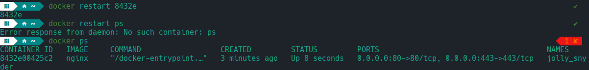
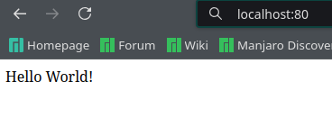

## Part 1. Готовый докер

1) Проверил наличие docker-образа через `docker images`.

2) Запустил docker-образ и проверил что он запустился.

3) Посмотрел через `docker inspect` и нашел размер контейнера, список замапленных портов и ip.

4) Остановил контейнер и проверил что он остановился.

5) Запустил контейнер и пробросил порты с контейнера на такие же порты localhost.

6) Проверил что по адресу `localhost:80` доступна страница nginx

7) Перезапустил контейнер и проверил он перезапустился.

## Part 2. Операции с контейнером

1) Прочитал конфигурационный файл nginx.conf внутри контейнера с помощью `exec`.

2) Создал конфигурационный файл и настроил отдачу страницы сервера nginx.

3) Скопировал файл nginx.conf внутрь контейнера через `docker cp`.

4) Перезапустил nginx внутри контейнера.

5) Проверил что по адресу `localhost:80/status` отдается страничка со статусом. 

6) Экспортировал контейнер в файл container.tar через команду `export` и остановил контейнер.

7) Удалил образ через команду `docker rmi -f`.

8) Удалил контейнер через команду `docker rm`.

9) Импортировал контейнер обратно из файла container.tar.

10) Проверил что по адресу `localhost:80/status` отдается страничка со статусом.

## Part 3. Мини веб-сервер

1) Написал мини-сервер который возвращает `Hello World!`.

2) Изменил nginx.conf что бы он проксировал запросы с 81 порта на 8080.

3) Запустил сервер через `spawn-fcgi` на порту 8080.

4) Проверил что по адресу `localhost:81` отдается написанная мной страничка.  

## Part 4. Свой докер 

1) Написал свой `Dockerfile`.

2) Собрал свой образ через команду `docker build`.

3) Проверил что все собралось коректно.

4) Запустил контейнер с этим docker images.

5) Проверил что по адресу `localhost:80` доступна строничка сервера.

6) Дописал nginx.conf что бы была доступна страничка со статусом. 

7) Проверил что страничка отдается.

## Part 5. Dockle

1) Проверил с помощью утилиты `Dockle` свой образ на ошибки.

2) Исправил ошибки.

## Part 6. Базовый Docker Compose

1) Собрал 2 docker образа и запустил контейнеры.

2) Проверил что страничка отдается.

